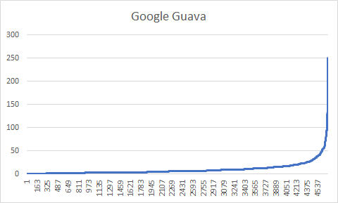
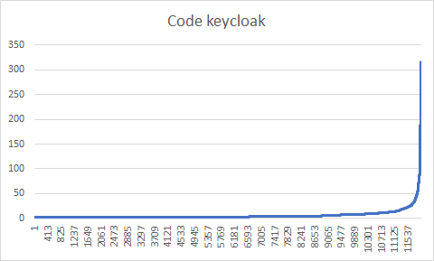
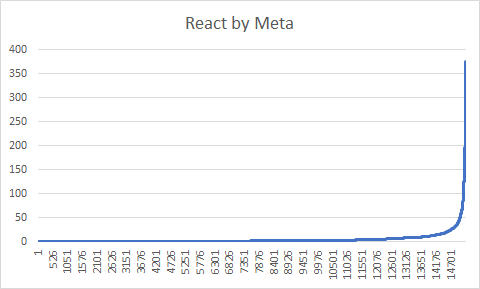
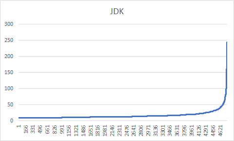

# Getting Started

### Generate dataset

run this command to generate dataset
```bash
git log --pretty=medium --name-only > ./commits.txt
```
This will print ALL commits in the repository to a file called `commits.txt` in the `gitStats` directory.

Each commits will appear as such:
```
commit 81b35ff3deer516f45758edfa8815fef260fdsdfdsd2
Author: USERNAME <an.email@example.net>
Date:   Tue Jun 25 11:46:42 2013 +0200

    Formulaire d'ajout et insertion via WebService un nouveau patient

src/main/java/san/plfr2/dto/PatientDTO.java
src/main/java/san/plfr2/entities/Patient.java
src/main/java/san/plfr2/services/PatientService.java
src/main/java/san/plfr2/services/impl/PatientServiceImpl.java
src/main/java/san/plfr2/ws/PatientWS.java
src/main/webapp/angular/js/Plfr2.js
src/main/webapp/angular/js/controllers/CreationPatientCtrl.js
src/main/webapp/angular/templates/views/creationPatient.html
src/main/webapp/css/bootstrap-plfr2.css


commit...
```

### setup java
This project use java 21.

You can use sdkman to setup on your shell java 21
```bash
sdk install java 21.0.3-amzn
sdk use java 21.0.3-amzn
```

### build file parser

run this command to build the file parser
```bash
mvn clean install
```

### run file parser

run this command to run the file parser
```bash
java -jar ./target/gitStats-0.0.1-SNAPSHOT.jar
```
ou can also run the file parser with the following command
```bash
java ./src/main/java/app/cbo/gitstats/GitStatsApplication.java
```


## Examples

Each sample on the x-axis is a file in the reposittory (actually found in a commit).

Y-axis is number of occurences of this file in the commits.



<i>Files occuring only once or twice had to be removed from graph, because of an technical excel limitation</i>







<i>Files occuring less than 10 times had to be removed from graph, because of an technical excel limitation</i>
